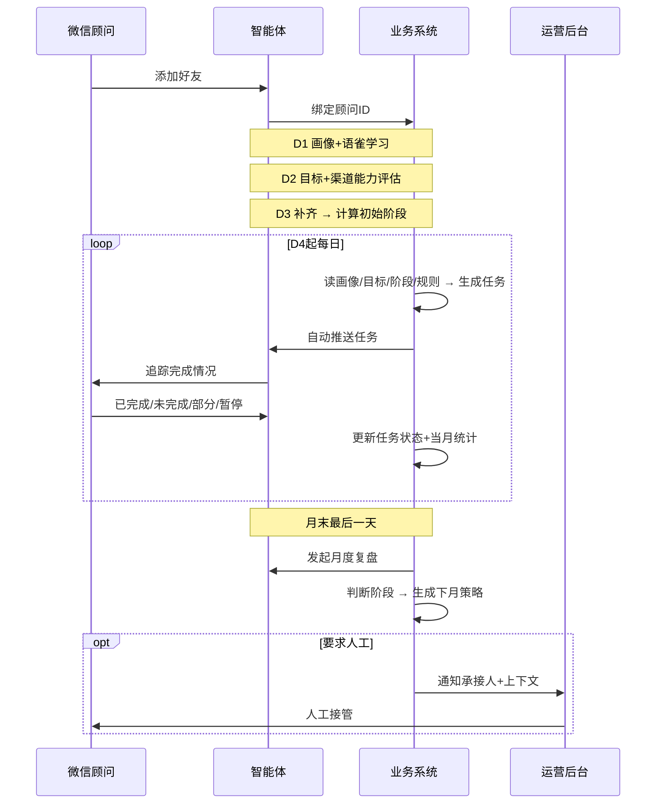
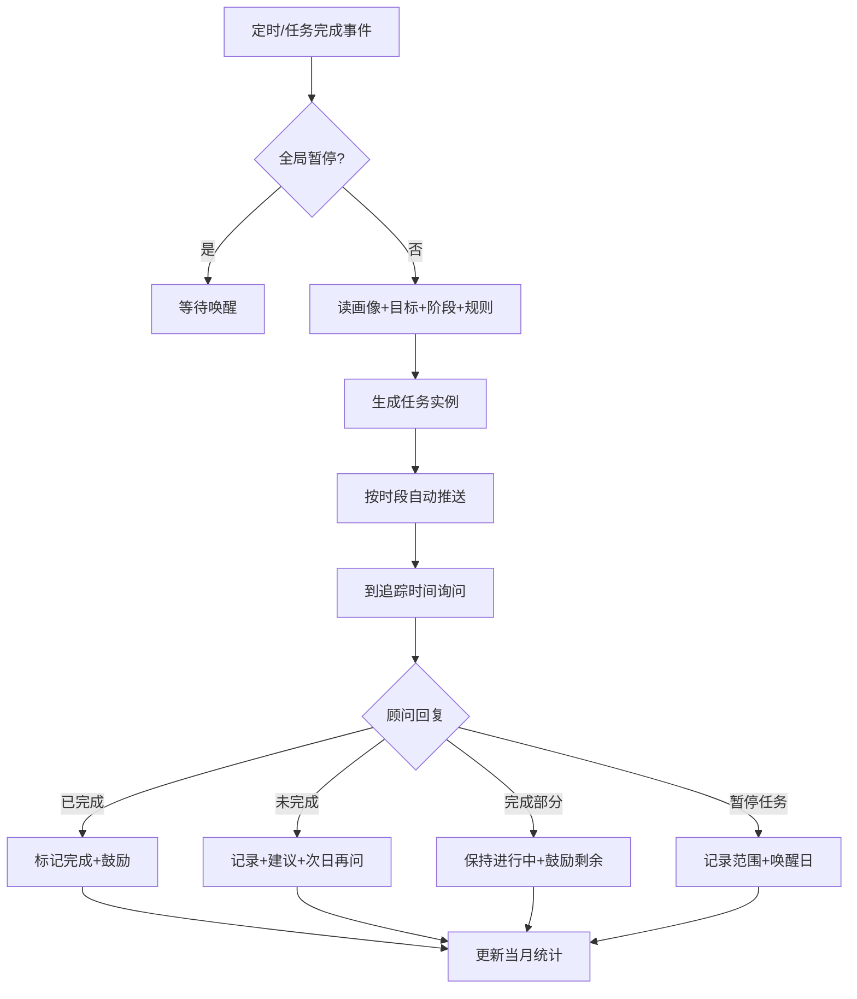

# EVT 智能体主理人孵化系统 — 开发需求文档

> 版本：V1.0-dev | 日期：2026-07-16 | 来源：产品方案 V1.0 精简版

---

## 1. 一句话说明

以个人微信智能体为顾问唯一交互端，运营后台为配置端，完成顾问从**建档 → 学习 → 目标规划 → 自动任务 → 执行追踪 → 月末复盘 → 阶段调整**的全流程陪伴；后台只维护知识/模板/规则/素材，不逐人运营。

---

## 2. 业务闭环

```
学习认知 → 画像建立 → 目标规划 → 能力评估 → 个性化任务 → 执行确认 → 阶段判断 → 复盘优化 → 下一阶段任务
```

| 环节 | 触发 | 产出 |
|------|------|------|
| 建档（D1-D3） | 首次加好友 | 画像、学习状态、目标、渠道能力等级、初始成长阶段 |
| 日常任务（D4+） | 定时/任务完成事件 | 任务实例、执行记录、当月统计 |
| 月末复盘 | 每月最后一天定时 | 复盘记录、阶段变更、下月任务策略 |
| 人工承接 | 顾问要求人工 / 复盘提建议 | 通知承接人、上下文摘要、人工接管 |

---

## 3. 系统边界

### 3.1 端口

| 端口 | 职责 |
|------|------|
| **智能体端（微信）** | 对话、任务推送、追踪、内容生成、暂停唤醒、复盘 |
| **运营后台** | 顾问管理、知识库、任务模板、成长规则、素材、复盘、数据、系统配置 |

### 3.2 外部依赖（第三方微信工具）

- 支持：文字/图片/文件/链接收发、定时推送、消息回调、好友识别、人工接管
- 必须回传：可关联顾问 ID 的微信标识、消息 ID、时间、发送状态
- 异常处理：消息入待发送队列 → 自动重试 → 超限后写入后台异常记录

### 3.3 本期不做

- 朋友圈/社群/线下活动真实性校验（**仅以顾问文字确认为完成依据**）
- 任务推送前人工审核
- 实际奖励发放

---

## 4. 核心实体

```
Advisor（顾问）
  ├── Profile（画像）
  ├── Goals（目标）
  ├── ChannelAbility（渠道能力，按渠道 L0-L3）
  ├── GrowthStage（成长阶段：基础执行 / 稳定运营 / 进阶成长）
  └── PauseState（暂停状态，可按任务类型或全局）

TaskTemplate（任务模板）  ← 后台配置
GrowthRule（成长规则）    ← 后台配置
TaskInstance（任务实例）  ← 系统生成

Knowledge（知识库）       ← 后台发布后可被 RAG 检索
Material（素材）          ← 沿用电商后台，带标签/有效期

MonthlyReview（月度复盘）
Handoff（人工承接记录）
```

### 4.1 任务实例状态机

```
pending → pushed → tracking → completed
                           → partial（进行中）
                           → incomplete（次日继续追踪）
                           → paused（到期唤醒）
                           → cancelled
```

### 4.2 顾问孵化阶段

```
onboarding_day1（画像+学习）
  → onboarding_day2（目标+渠道评估）
    → onboarding_day3（补齐评估）
      → active（自动任务阶段）
        ↔ global_paused（全局暂停，仅唤醒询问+主动问答）
```

---

## 5. 主流程（开发实现顺序）

### 5.1 全生命周期



### 5.2 前三天固定流程（D1-D3）

| 天 | 动作 | 完成条件 |
|----|------|----------|
| **D1** | 自我介绍 → 画像采集（逐项追问）→ 发语雀资料 → 记录学习计划 | 画像必填项完整 + 学习计划已记录 |
| **D2** | 采集短/长期目标 → 调研各渠道现状 | 目标含方向+周期 + 各渠道状态完整 |
| **D3** | 补齐缺失项 → 计算渠道等级(L0-L3) + 初始成长阶段 | 进入 `active` 状态 |

**规则：**
- 一天内未完成项不虚构，次日先补关键项再继续当日流程
- 画像必填：从业经历、擅长领域、目标客户、未来方向
- 非必填被拒答记「暂不提供」，不重复催问

### 5.3 日常任务流程（D4+）



**推送规则：**
- 默认时段 09:00-20:00（可配置）
- 生成后直接推送，无人工审核
- 顾问主动对话中 → 延后推送
- 已暂停类型 → 不生成、不推送、不追踪

**完成确认规则：**
- 明确词（「已发」「完成了」等）→ 直接完成
- 模糊词（「差不多」「正在做」）→ 追问一次，不标记完成
- 保存：确认原文 + 时间 + 任务 ID

### 5.4 暂停与唤醒

| 场景 | 行为 |
|------|------|
| 按任务类型暂停 | 停止该类型推送/催促，其他类型正常 |
| 全局暂停 | 除唤醒询问和主动问答外，不推成长任务 |
| 唤醒周期 | 顾问指定 > 默认 7 天 |
| 到期 | 仅询问是否恢复，不连续推任务 |
| 继续暂停 | 重新记录周期，未指定再顺延 7 天 |

### 5.5 月度复盘与阶段判断

**唯一触发点：每月最后一天定时（日常任务完成不触发阶段变更）**

```
汇总当月指标 → 多轮复盘对话 → 判断维持/调整成长阶段 → 生成下月任务策略
（次月1日00:00生效，不回溯当月数据）
```

| 指标 | 口径 |
|------|------|
| 任务完成率 | 已完成 ÷ 已到期且未取消 |
| 有效完成数 | 文字确认完成数 |
| 部分完成数 | 选「完成部分」且月末仍未全部完成 |
| 未完成数 | 明确选「未完成」 |
| 暂停任务数 | 进入暂停的任务数（同任务多次暂停计 1 次） |
| 互动天数 | 有有效回复的自然日数 |

**阶段判断：**
- 有有效任务数据 → 结合指标+复盘反馈决定
- 无有效任务/全月暂停/关键数据缺失 → 阶段不变
- 全局暂停时 → 轻量复盘（暂停原因+下月恢复计划），不推新任务
- 每自然月仅 1 条正式复盘记录

---

## 6. 渠道能力等级（任务生成输入）

| 等级 | 条件 | 任务方向 |
|------|------|----------|
| L0 未启动 | 无账号/社群，有意愿 | 搭建、基础资料、首次发布 |
| L1 起步 | 有渠道但近 7 天无稳定执行 | 低难度启动任务 |
| L2 执行 | 近 7 天能执行但不稳定 | 固定频率、内容生产 |
| L3 稳定 | 有稳定习惯 | 优化效果、活动、转化、IP 一致性 |

顾问标记「不纳入当前计划」的渠道 → 不生成对应任务。

---

## 7. 任务生成规则

### 输入
画像、当前目标、成长阶段、各渠道等级、近 7 天完成情况、后台规则/模板/素材

### 规则
1. 读取当前阶段对应的**已启用**生成规则，直接确定当天任务类型
2. 内容结合主目标 + 画像 + 渠道现状 + 有效素材组装
3. 已暂停/不运营渠道 → 跳过
4. 难度按近 7 天**本人**完成情况调整
5. 每「阶段 + 任务类型 + 触发周期」仅允许 1 条启用规则；重复则禁止发布
6. 无启用规则 → 当天不生成，后台记「缺少任务生成规则」

---

## 8. 功能模块清单（开发拆分）

### 8.1 智能体端

| 模块 | 触发 | 核心逻辑 | 数据写入 |
|------|------|----------|----------|
| 初识与画像 | 首次识别 | 逐项采集→AI解析→缺失追问→摘要确认 | Profile |
| 企业学习 | D1 画像启动后 | 发语雀链接→记计划→到期询问→文字确认 | LearningRecord |
| 知识问答 | 顾问提问 | 意图识别→RAG 检索已发布知识→回答/兜底 | QALog |
| 目标采集 | D2 | 追问至含方向+周期→确认 | Goals |
| 渠道评估 | D2-D3 | 逐渠道调研→算 L0-L3 | ChannelAbility |
| 任务推送 | 定时 | 读规则生成→按时段发送 | TaskInstance |
| 任务追踪 | 到追踪时间 | 四选一回复→更新状态+鼓励 | TaskInstance |
| 内容生成 | 主动需求/任务配套 | 画像+素材+知识→生成/改写 | ContentDraft |
| 暂停唤醒 | 顾问表达/到期 | 记范围+周期→拦截推送→到期询问 | PauseState |
| 月度复盘 | 月末定时 | 汇总指标→多轮问答→阶段判断 | MonthlyReview |
| 人工承接 | 要求人工/复盘建议 | 停自动回复→摘要→通知承接人 | Handoff |

### 8.2 运营后台

| 模块 | 核心能力 |
|------|----------|
| 顾问管理 | 列表/详情/搜索；画像来源、版本、人工修正（修正后立即生效） |
| 知识库 | 上传/分类/版本/启停/发布；仅「已发布」进检索；测试检索入口 |
| 任务模板 | 类型、阶段、渠道、等级、步骤、频率、完成口径、互斥、启停 |
| 成长规则 | 阶段条件、任务上限、发送时段、追踪时间、阈值、唤醒周期 |
| 任务记录 | 生成依据、状态、发送日志、顾问回复、异常 |
| 素材管理 | 沿用电商后台 + 类型/渠道/人群/主题/有效期标签 |
| 复盘管理 | 摘要、原始对话、建议标记、承接人、人工接管入口 |
| 数据分析 | 激活率、画像完成率、学习完成率、任务完成率、阶段分布等 |
| 系统配置 | 微信通道、发送时段、重试策略、承接人、基础话术 |

---

## 9. 关键业务规则速查

| # | 规则 |
|---|------|
| 1 | 画像冲突以顾问最新明确表述为准，保留历史版本 |
| 2 | 后台人工修改画像优先级 > AI 推断 |
| 3 | 知识问答仅用「已发布」内容；相关度不足则明确告知，不编造 |
| 4 | 任务完成仅认顾问文字确认，不要求截图 |
| 5 | 未完成同日不反复催促，次日继续 |
| 6 | 日常任务结果只记统计，**不即时变更成长阶段** |
| 7 | 阶段调整唯一入口 = 月末复盘 |
| 8 | 产品事实/参数必须来自已发布知识或有效素材 |
| 9 | 过期/停用素材不得进入生成上下文 |
| 10 | 通道异常：队列重试 → 超限记异常待人工处理 |

---

## 10. 人工介入边界

| 系统自动 | 人工只做 |
|----------|----------|
| 画像提问/解析/更新 | 后台查看修正画像 |
| 学习推送/提醒/确认 | 维护语雀链接 |
| RAG 问答 | 维护/发布知识 |
| 任务生成/推送/追踪/完成 | 维护模板、规则、素材（不逐条审核） |
| 暂停识别与唤醒 | 无常规操作 |
| 月末阶段判断 | 维护月度规则 |
| 鼓励话术（无实际奖励） | — |
| 人工触发通知+摘要 | 承接人接管沟通 |
| 指标自动汇总 | 查看分析、优化规则 |

---

## 11. MVP 验收清单

- [ ] 顾问仅通过微信完成全部操作
- [ ] D1-D3 按固定顺序建档，缺失项可追问补齐
- [ ] D4 起按规则自动生成并推送任务，后台可追溯生成依据
- [ ] 明确文字确认才标记完成，模糊表达不误判
- [ ] 按类型/全局暂停生效，指定或默认 7 天唤醒
- [ ] 月末自动复盘一次，据此调整阶段和下月策略
- [ ] 人工场景能通知承接人并附上下文
- [ ] 后台 9 大模块可用
- [ ] 消息、任务、确认、阶段计算、人工触发均可追溯

---

## 12. 待开发确认项

| 项 | 说明 |
|----|------|
| 顾问 ID 与微信好友绑定 | 本期假设第三方已绑定，绑定机制不在本期 |
| 语雀资料链接 | 后台配置还是硬编码 |
| 任务生成 LLM Prompt | 需单独 Prompt 文档 |
| 第三方微信 API 接口契约 | 需对接文档 |
| 素材模块接口 | 沿用电商后台，需确认 API |
