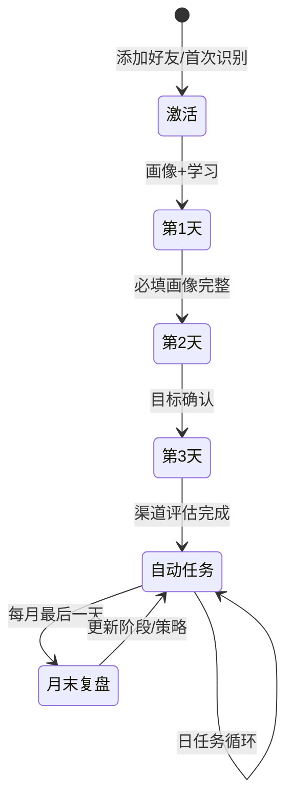

# EVT 智能体主理人系统 — 开发版 PRD

| 版本 | 日期 | 读者 |
|---|---|---|
| V1.0-dev | 2026-07-16 | 后端 / 前端 / 算法 / 测试 |

---

## 1. 一句话说明

**个人微信智能体**陪伴健康顾问完成「建档 → 学习 → 目标 → 任务 → 复盘」；**运营后台**只维护知识、模板、素材、规则，不逐人审任务。

**业务闭环：**

```
学习认知 → 画像 → 目标 → 能力评估 → 生成任务 → 推送 → 追踪/确认 → 月末复盘 → 调阶段/策略 → 下月任务
```

---

## 2. 系统边界

| 项 | 说明 |
|---|---|
| 顾问端 | 仅个人微信文字交互（收发文字/图片/文件/链接） |
| 后台端 | 配置 + 查看 + 人工承接 |
| 完成判定 | **仅顾问文字确认**，不验朋友圈/社群真实执行 |
| 任务推送 | 自动生成，**不经人工审核** |
| 阶段变更 | **仅月末复盘**触发，日常任务只记数不改阶段 |
| 外部依赖 | 第三方微信工具：消息收发、定时推送、回调、好友 ID、人工接管 |

**通道异常：** 消息入待发送队列 → 自动重试 → 超限记入后台异常，人工处理。

---

## 3. 角色与模块

```
┌─────────────┐     回调/推送      ┌──────────────────┐
│ 第三方微信   │ ◄──────────────► │ 智能体服务        │
│ 工具        │                  │ (对话/任务/生成)  │
└─────────────┘                  └────────┬─────────┘
                                          │
┌─────────────┐     配置/查询      ┌──────▼─────────┐
│ 运营人员     │ ◄──────────────► │ 运营后台        │
└─────────────┘                  └──────────────────┘
```

### 3.1 智能体端（顾问侧）

| 模块 | 职责 |
|---|---|
| 初识建档 | 欢迎、能力说明、画像采集 |
| 企业学习 | 第 1 天发语雀链接，记录学习计划与完成 |
| 知识问答 | RAG 检索已发布知识，无答案则兜底 |
| 目标采集 | 第 2 天采集短/长期目标 |
| 能力评估 | 第 2–3 天调研各渠道现状，算等级 |
| 任务引擎 | 生成、推送、追踪、完成确认 |
| 内容生成 | 朋友圈/视频/社群/产品话术 |
| 暂停唤醒 | 按类型暂停，到期回访 |
| 月末复盘 | 汇总指标、多轮问答、阶段判断 |
| 人工转接 | 顾问要人工 / 复盘提建议 → 通知承接人 |

### 3.2 后台端（运营侧）

| 模块 | 职责 |
|---|---|
| 顾问管理 | 列表/详情、画像查看与人工修正 |
| 知识库 | 上传、分类、版本、发布、测试检索 |
| 任务模板 | 类型、阶段、步骤、频率、完成口径等 |
| 成长规则 | 阶段条件、频控、时段、唤醒周期 |
| 任务记录 | 生成依据、状态、发送日志、顾问回复 |
| 素材管理 | 复用电商后台，标签 + 启停 + 有效期 |
| 复盘管理 | 复盘记录、个人建议、人工跟进 |
| 数据分析 | 学习/任务/渠道/阶段等指标 |
| 系统配置 | 微信通道、重试、承接人、基础话术 |

---

## 4. 核心实体与状态

### 4.1 顾问（Advisor）

| 字段（核心） | 说明 |
|---|---|
| id | 系统顾问 ID |
| wechat_id | 第三方回传的微信好友标识 |
| profile | 结构化画像（见 4.2） |
| goals | 短/长期目标 |
| channel_levels | 各渠道能力等级 L0–L3 |
| growth_stage | `基础执行` / `稳定运营` / `进阶成长` |
| pause_state | 全局暂停 / 按任务类型暂停 + 唤醒日 |
| onboarding_day | 当前孵化日（1/2/3/4+） |

### 4.2 画像（Profile）

**必填：** 从业经历、擅长领域、目标客户、未来方向  
**选填：** 基础信息、兴趣、优势、表达风格（拒绝则记「暂不提供」）

规则：
- 每轮只问一个主题，自然语言解析，不重复已提供信息
- 冲突以顾问最新表述为准，保留历史版本
- 优先级：**人工修正 > 顾问明确表述 > AI 推断**

### 4.3 任务（TaskInstance）

| 状态 | 含义 |
|---|---|
| `generated` | 已生成待推送 |
| `sent` | 已推送 |
| `in_progress` | 部分完成 |
| `completed` | 顾问文字确认完成 |
| `incomplete` | 顾问选未完成，次日继续 |
| `paused` | 暂停，带唤醒日 |
| `cancelled` | 取消（规则/互斥等） |

### 4.4 渠道能力等级

| 等级 | 条件 | 任务方向 |
|---|---|---|
| L0 | 无账号/社群 + 有意愿 | 搭建、首次发布 |
| L1 | 有渠道但近 7 天无稳定执行 | 低难度启动任务 |
| L2 | 近 7 天能执行但不稳定 | 固定频率 + 内容任务 |
| L3 | 稳定习惯，能独立完成 | 优化、活动、转化 |
| 不纳入 | 顾问明确不用该渠道 | **不生成该渠道任务** |

---

## 5. 主流程（开发按序实现）

### 5.1 顾问生命周期



**跨日规则：** 当天未完成项不虚构；次日先补关键项，再执行当日固定流程。前三天全部完成后，**最早第 4 天**进入自动任务。

### 5.2 前三天固定流程

| 天 | 动作 | 完成条件 |
|---|---|---|
| D1 | 能力介绍 → 画像采集 → 发语雀资料 → 问学习计划 | 必填画像完整 + 学习计划已记录 |
| D2 | 采集短/长期目标（含方向、周期） | 目标确认 |
| D3 | 调研朋友圈/微信群/小红书/抖音/微博等 | 各渠道状态完整 → 算初始等级与阶段 |

### 5.3 自动任务循环（D4+）

```
每日定时 / 任务完成事件
  → 顾问全局暂停? → 是: 跳过
  → 读画像+目标+阶段+渠道+规则
  → 匹配模板生成任务（无启用规则则记异常，不生成）
  → 推送（遵守发送时段，对话中则延后）
  → 到追踪时间询问
  → 处理四种回复 → 更新当月统计
```

**追踪四选一：**

| 回复 | 系统动作 |
|---|---|
| 已完成 | 关任务 + 鼓励话术 |
| 未完成 | 记未完成 + 一条建议，**次日再问**（当天不反复催） |
| 完成部分 | 保持进行中，鼓励 + 提示剩余 |
| 暂停任务 | 记暂停范围与唤醒日，停该类催促 |

**文字完成判定：**

- 明确（「已发」「完成了」「建好了」）→ 直接完成
- 模糊（「差不多」「正在做」）→ 追问一次，不标记完成
- 保存：确认原文 + 时间 + task_id

### 5.4 暂停与唤醒

1. 识别暂停意图 → 确认**暂停对象**（任务类型/全局）和**恢复时间**
2. 有周期用顾问指定；无则 **默认 7 天**
3. 暂停类型：不生成、不推送、不追踪该类任务；其他类型正常
4. 到期只问是否恢复，**不连续推任务**
5. 全局暂停：除唤醒询问和主动问答外，不发成长任务

### 5.5 月末复盘（唯一阶段变更入口）

**触发：** 每月最后一天定时，每自然月仅 1 条正式记录（重复触发复用）

**统计周期：** 当月 1 日 00:00 至复盘触发时；新顾问从首次激活起算

| 指标 | 公式 |
|---|---|
| 任务完成率 | 已完成 ÷ 已到期且未取消 |
| 有效完成数 | 文字确认完成数 |
| 部分完成数 | 选「完成部分」且月末仍未全完成 |
| 未完成数 | 明确选未完成 |
| 暂停任务数 | 进入暂停的任务数（同任务多次暂停计 1 次） |
| 互动天数 | 有有效回复的自然日数 |

**阶段判断：**
- 有有效任务数据 → 结合指标 + 复盘反馈，维持或升阶段
- 无任务 / 全月暂停 / 关键数据缺失 → **阶段不变**
- 调整从**次月 1 日**生效，不回溯历史

**复盘内容：** 公司认知（仅首次）→ 行业认知 → 任务表现 → 障碍 → 体验反馈 → 输出总结 + 下月重点  
**个人建议** → 原文保存 + 通知承接人

全局暂停时：仍做轻量复盘（原因 + 下月恢复计划），不推新任务。

---

## 6. 任务生成规则（算法/引擎）

### 6.1 输入

- 画像、目标、成长阶段、渠道等级、近 7 天完成率、暂停状态、有效素材

### 6.2 生成逻辑

1. 按当前阶段的**唯一启用规则**确定任务类型（重复配置禁止发布）
2. 内容 = 模板 + 画像 + 主目标 + 渠道现状 + 素材
3. 已暂停 / 不运营渠道 → 跳过
4. 难度按**本人近 7 天完成率**调整，不做顾问间比较
5. 无启用规则 → 当天不生成，后台记「缺少任务生成规则」

### 6.3 推送规则

- 时段：后台配置，建议 09:00–20:00
- 生成后直接推，无审核
- 顾问主动对话中 → 延后推送
- 失败 → 重试队列

---

## 7. 内容与知识

### 7.1 企业学习（D1）

- 发语雀链接（公司/产品/商业模式等）
- 记录计划完成时间 → 到期询问 → 文字确认完成
- 未完成：问新计划时间；无时间则次日再问（当日不反复催）

### 7.2 知识问答

- 仅用**已发布**知识做 RAG
- 相关度不足 → 明确告知，不编造
- 记录：问题、命中资料、知识版本、回答

### 7.3 内容生成

**触发：** 顾问主动要 / 任务需要配套内容

**输出格式：**
- 朋友圈：主题 + 正文 + 配图建议 + 发布时间
- 视频：开场 + 核心 + 行动引导 + 建议时长
- 社群：欢迎语 / 公告 / 互动 / 产品 / 邀约

**约束：** 产品事实仅来自已发布知识或有效素材；支持同上下文改写（更口语/缩短等）

---

## 8. 人工承接

| 触发场景 | 系统动作 |
|---|---|
| 顾问明确要求人工 | 停自动回复 → 摘要上下文 → 通知承接人 → 第三方工具接管 |
| 复盘提出个人建议 | 保存原文 → 通知承接人 |

人工处理完成后，策略写回系统，智能体继续下一轮（流程不中断）。

---

## 9. 后台配置清单（实现检查表）

### 9.1 任务模板字段

`名称` `任务类型` `适用阶段` `适用渠道` `适用能力等级` `目标标签` `难度` `步骤` `预计耗时` `推荐频率` `冷却周期` `完成口径` `所需素材` `互斥任务` `优先级` `兜底文案` `有效期` `启停`

### 9.2 成长规则字段

`每日任务上限` `发送时段` `追踪时间` `阶段阈值` `观察周期` `默认唤醒周期(7天)` `规则版本`

### 9.3 素材标签（在电商素材上扩展）

`内容类型` `适用产品` `适用渠道` `适用人群` `内容主题` `有效期` `审核状态` `启停`

### 9.4 系统配置

微信通道参数、重试次数、承接人映射、欢迎/鼓励话术模板、操作日志

---

## 10. 数据分析（后台只读）

| 指标 | 口径 |
|---|---|
| 激活率 | 首次对话数 ÷ 已关联数 |
| 画像完成率 | 必填完整数 ÷ 已激活数 |
| 学习完成率 | 学习确认完成 ÷ 收到学习任务数 |
| 任务完成率 | 已完成 ÷ 已到期未取消 |
| 暂停率 | 发生过暂停的任务 ÷ 已推送 |
| 互动率 | 有回复顾问数 ÷ 有触达顾问数 |
| 阶段分布 | 各阶段人数占比 |
| 渠道执行 | 各渠道完成数/完成率/参与人数 |
| 人工介入量 | 要人工次数 + 复盘建议次数 |

支持按时间、阶段、渠道、任务类型筛选下钻。

---

## 11. 系统 vs 人工（实现边界）

| 事项 | 系统自动 | 人工 |
|---|---|---|
| 画像 | 提问/解析/更新 | 后台修正（最高优先级） |
| 学习/问答 | 推送/提醒/RAG | 维护知识与资料链接 |
| 任务 | 生成/推送/追踪/确认 | 维护模板/素材/规则 |
| 完成判定 | 文字确认 | 不审核真实性 |
| 阶段 | 月末自动判断 | 维护阶段规则 |
| 奖励 | 鼓励话术 only | 本期无实物奖励 |
| 异常 | 重试 + 记日志 | 重试失败后处理 |

---

## 12. 验收要点（测试用例摘要）

1. 顾问全程仅微信完成，无需小程序
2. D1–D3 按序建档，缺项次日补齐，D4 起自动任务
3. 任务可自动生成、推送，后台可追溯生成依据
4. 明确文字确认才完成；模糊表达不误判
5. 按类型暂停后停催促，指定周期或 7 天唤醒
6. 每月最后一天触发一次复盘，据此调阶段与下月策略
7. 人工场景：承接人收到通知 + 上下文，可接管对话
8. 核心消息、任务、确认、阶段计算、人工触发均可追溯

---

## 13. 本期不做

- 顾问 ID 与微信绑定的备注机制设计
- 朋友圈/社群/线下执行真实性校验
- 任务人工审核流
- 实物/线下奖励发放
- 非月末触发的阶段变更

---

## 附录：鼓励话术触发（无奖励）

| 场景 | 要点 |
|---|---|
| 首次完成 | 强调行动启动 |
| 连续完成 | 反馈连续天数 + 任务类型，不虚构排名 |
| 部分完成 | 肯定已完成 + 一个最小下一步 |
| 未完成 | 不批评，缩小任务或延续次日 |
| 月末复盘 | 可验证成果 + 下月重点 |
